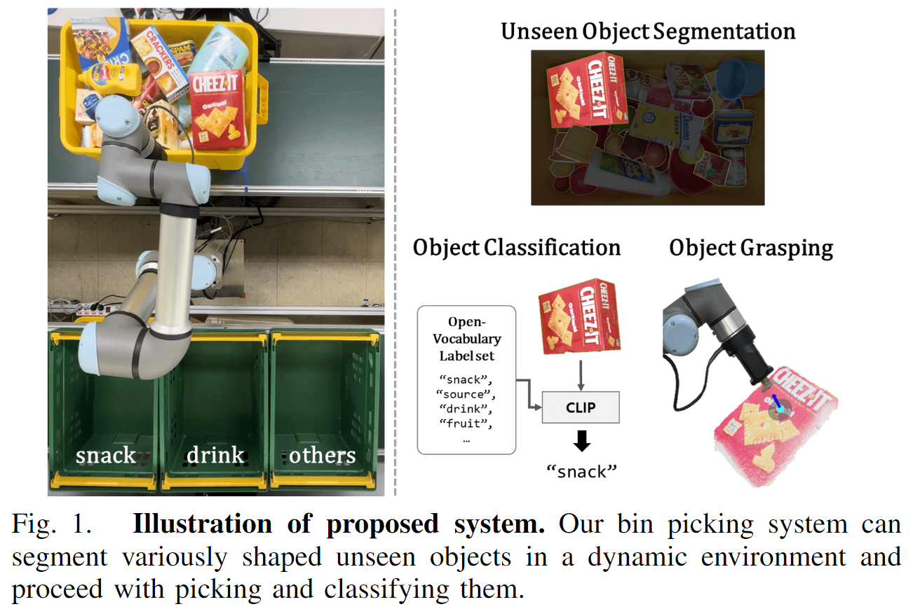
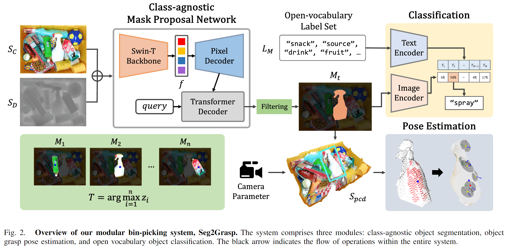

# Seg2Grasp: A Robust Modular Suction Grasping in Bin Picking
- Institutes: Seoul National University
  

## Abstract
Current bin picking methods predominantly rely on end-to-end learning-based strategies to identify the optimal picking points on target objects.
However, these approaches face significant challenges in environments with unfamiliar, unseen objects. To address these limitations, we introduce Seg2Grasp, a novel pipeline designed for robust suction grasping in dynamic, cluttered bin scenarios, eliminating the need for controlled environments or prior knowledge of objects.
The Seg2Grasp framework employs a distinctive methodology. Initially, the module utilizes RGBD images to generate class-agnostic mask proposals, effectively delineating objects irrespective of their size, shape, or orientation. 
These proposals, in conjunction with surface normals, assist the module in identifying optimal suction points. Furthermore, the module introduces an advanced capability of open-vocabulary classification, enabling the system to recognize and adapt to a wide range of objects with remarkable precision. 
Significantly, Seg2Grasp outperforms existing methods in real-world robotic experiments, showcasing superior grasp success rates and adaptability to diverse and intricate object configurations. This underscores its practical effectiveness and potential as a versatile solution in automated picking operations.

## Method Overview

## Acknowledgements
Our study used Detectron2 and Mask2Former.

:link: [Detectron2](https://github.com/facebookresearch/detectron2)  
:link: [Mask2Former](https://github.com/facebookresearch/Mask2Former)  
