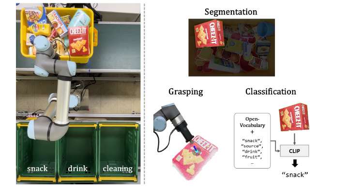
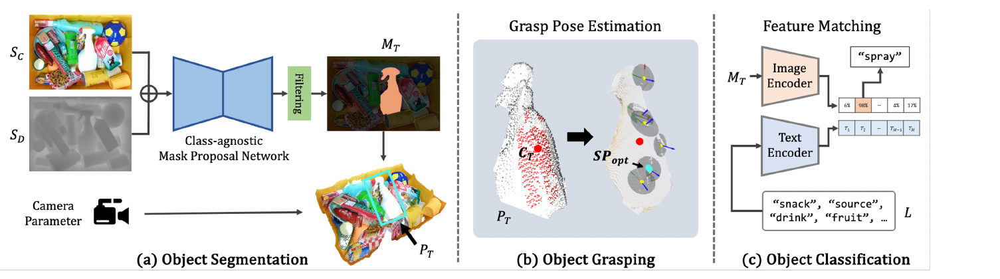
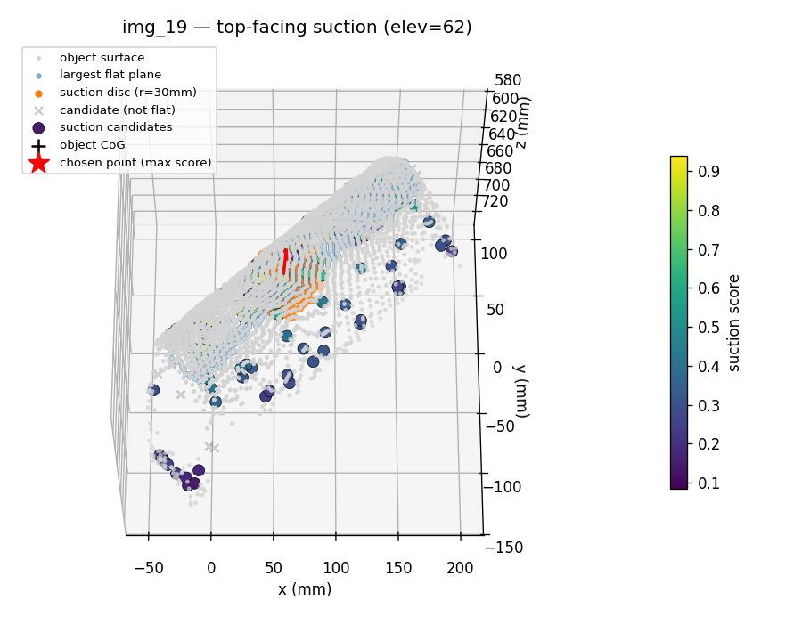

<div align="center">

# Seg2Grasp: A Robust Modular Suction Grasping in Bin Picking

**Hye-Jung Yoon**<sup>1\*</sup> · **Juno Kim**<sup>1\*</sup> · **Yesol Park**<sup>1\*</sup> · **Jun-Ki Lee**<sup>2</sup> · **Byoung-Tak Zhang**<sup>1,2,3</sup>

<sup>1</sup>Interdisciplinary Program in AI, Seoul National University · <sup>2</sup>AI Institute, SNU · <sup>3</sup>Dept. of Computer Science, SNU
<br><sub>\*Equal contribution</sub>

**IEEE/RSJ IROS 2024**

[](https://doi.org/10.1109/IROS58592.2024.10801644)
[](https://arxiv.org/abs/2607.17757)
[](https://github.com/teamROBI/Seg2Grasp)
[](LICENSE)
[](https://www.python.org/)



</div>

> **TL;DR** — Seg2Grasp is a **modular** suction bin-picking pipeline — **segment → grasp → classify** — that robustly transfers arbitrary, unseen objects between bins in cluttered, dynamic scenes, outperforming end-to-end methods (DexNet 4.0, SuctionNet).

## Abstract
Current bin-picking methods that rely heavily on end-to-end learning often falter when confronted with unfamiliar or complex objects in unstructured environments. To overcome these limitations, we introduce **Seg2Grasp**, a modular pipeline designed for robust suction grasping in dynamic and cluttered bin scenarios. Seg2Grasp is built on a three-step process: **Segmentation, Grasping, and Classification**. The *Segmentation* module employs a Transformer-based model to generate class-agnostic object masks from RGB-D images, ensuring accurate detection across various conditions. The *Grasping* module uses surface normals and mask proposals to determine the optimal suction points, enhancing grasp success. Finally, the *Classification* module leverages open-vocabulary matching for precise object identification, enabling versatile handling of diverse objects. Real-world robotic experiments demonstrate that Seg2Grasp outperforms existing methods in success rates and adaptability, establishing it as a powerful tool for automated bin picking in industrial settings.

> **ℹ️ Note on this code release.** The published system used a fine-tuned **Mask-CLIP** classifier. This repository **upgrades the classification module to a Qwen vision-language model** (the segmented target + full scene are shown to the VLM, which names the category) — simpler to reproduce and open-vocabulary. **Segmentation and grasping follow the paper.**

## Method

<div align="center"></div>

Seg2Grasp is three specialized modules orchestrated by a single pipeline:

1. **Segmentation** — a Mask2Former (Swin-L) **class-agnostic** mask-proposal network fed the RGB image fused with an inverted, normalized depth image (its shared backbone runs on each and the outputs are averaged). Produces per-object instance masks.
2. **Grasping** — an **analytic** (non-learning) suction planner. It samples geometrically-uniform candidate points over the target's point cloud and scores each by a weighted criterion (paper Eq. 2): surface angle (how top-facing the patch normal is) + proximity to the object's center of gravity + graspable-point count, returning the optimal suction point and camera-facing normal.
3. **Classification** — an **open-vocabulary** classifier. This release uses a **Qwen VLM**: the full scene (for context) + the cropped target are shown to the model, which returns the object category.

<div align="center"><br><sub>Suction-point selection: object surface → RANSAC plane inliers → cup-sized disc → scored candidates → chosen point (red) with camera-facing normal.</sub></div>

## Results

**Real-robot picking success across difficulty levels** (paper Table I). `pr` = pick success, `or` = object success, `sr` = segmentation success.

| Level | Method | pr | or | sr |
|---|---|:--:|:--:|:--:|
| **Easy** (single, trained) | DexNet 4.0 | 0.85 | 0.94 | – |
| | SuctionNet | 0.72 | 0.92 | 0.93 |
| | **Seg2Grasp (ours)** | **0.89** | **0.96** | **0.91** |
| **Medium** (double, mixed) | DexNet 4.0 | 0.41 | 0.61 | – |
| | SuctionNet | 0.51 | 0.53 | 0.43 |
| | **Seg2Grasp (ours)** | **0.87** | **0.91** | **0.89** |
| **Hard** (complex, novel) | DexNet 4.0 | 0.28 | 0.31 | – |
| | SuctionNet | 0.29 | 0.23 | 0.26 |
| | **Seg2Grasp (ours)** | **0.79** | **0.86** | **0.83** |


## Demo

Run the full pipeline on 24 bundled bin-picking frames (no camera/robot needed):

<div align="center"></div>

```bash
source venvs/seg/bin/activate
python demo/run.py                 # segmentation + suction grasp
python demo/run.py --grasp-steps   # + point-cloud suction-selection figures
# with classification (start the Qwen service first, see below):
python demo/run.py --qwen-url http://127.0.0.1:8765
```
See [`demo/README.md`](demo/README.md).

## Installation

Both environments are **Python 3.10 / PyTorch 2.x (cu128)** created with [`uv`](https://docs.astral.sh/uv/). Segmentation (detectron2 + the MSDeformAttn CUDA op) and classification (transformers 5) have conflicting deps, so they live in **two venvs**; the pipeline runs in the seg env and calls the Qwen classifier over a small local service. A CUDA toolkit (`CUDA_HOME`) is required to compile the native ops. `cu128` / arch `12.0` target NVIDIA Blackwell (sm_120) — adjust for your GPU.

```bash
bash scripts/setup_seg_env.sh     # -> venvs/seg   (torch, detectron2 from source, MSDeformAttn)
bash scripts/setup_qwen_env.sh    # -> venvs/qwen  (transformers 5, FP8 support)
```

## Weights

- **Segmentation checkpoint** (`model_final.pth` + `config.yaml`, ~2.5 GB) — hosted on
  Hugging Face at [`jkim50104/Seg2Grasp`](https://huggingface.co/jkim50104/Seg2Grasp):
  ```bash
  bash scripts/download_weights.sh               # -> data/checkpoints/segmentation/
  # or override the source repo:
  SEG2GRASP_WEIGHTS_HF="<user>/<repo>" bash scripts/download_weights.sh
  ```
- **Qwen classifier** — downloaded from Hugging Face on first use (nothing to link). Selectable:
  `serve_qwen.py --model 35b` (`Qwen/Qwen3.6-35B-A3B`, bf16, default) or `--model 27b-fp8`
  (smaller FP8; needs a working FP8 stack), or any HF repo id / local path.

## Usage

**Offline** (saved RGB-D frame):
```bash
source venvs/seg/bin/activate
python scripts/run_demo.py --scene Non-YCB/scene_hole_gray_bin --frame 0 --no-classify
```

**Classification service** (Qwen env), then point the pipeline at it:
```bash
source venvs/qwen/bin/activate && python scripts/serve_qwen.py --model 27b-fp8
# in the seg env:
python scripts/run_demo.py --scene MIXED --frame 3 --qwen-url http://127.0.0.1:8765
```

**Live Azure Kinect** (needs `pyk4a` + the Azure Kinect SDK):
```bash
python scripts/run_live.py --qwen-url http://127.0.0.1:8765 --roi 160,340,400,600
```
Robot actuation (UR5e + Robotiq AirPick) is an optional, hardware-specific stub — see [`seg2grasp/robot/README.md`](seg2grasp/robot/README.md).

## Repository layout
```
seg2grasp/         pipeline.py · segmentation/ · grasping/ · classification/ · camera/ · robot/
configs/           categories.yaml · mask2former/ (config chain)
scripts/           setup_*_env.sh · run_demo.py · run_live.py · serve_qwen.py · download_weights.sh
demo/              samples/ (24 frames) · run.py · gallery.jpg
third_party/       mask2former/ (vendored)
```

## Datasets
- **OCBD** (our bin-picking benchmark) — `{YCB, Non-YCB, MIXED}/<scene>/{rgb,depth,pcd}/img_N.*`; each frame has an RGB image and an organized point cloud. Segmentation is trained on UOAIS-Sim.

## Acknowledgements
This repository builds on [Mask2Former](https://github.com/facebookresearch/Mask2Former), [detectron2](https://github.com/facebookresearch/detectron2), and [Qwen](https://github.com/QwenLM).

## Citation
```bibtex
@inproceedings{yoon2024seg2grasp,
  title={Seg2Grasp: A Robust Modular Suction Grasping in Bin Picking},
  author={Yoon, Hye-Jung and Kim, Juno and Park, Yesol and Lee, Jun-Ki and Zhang, Byoung-Tak},
  booktitle={2024 IEEE/RSJ International Conference on Intelligent Robots and Systems (IROS)},
  pages={2921--2927},
  year={2024},
  organization={IEEE}
}
```

## License
MIT (see [LICENSE](LICENSE)). Vendored/dependent components (Mask2Former, detectron2, Qwen-VL) retain their own licenses.
