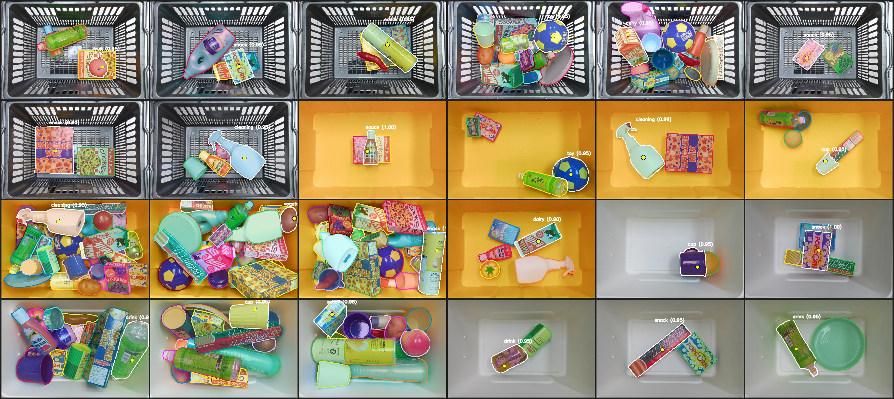

# Seg2Grasp demo

A self-contained demo of the full Seg2Grasp pipeline on 24 bundled bin-picking
frames (subset of OCBD `Non-YCB`, spanning sparse to cluttered bins).



Each tile: colored class-agnostic masks, the `target` object chosen to grasp, and
the suction point (yellow dot). Generated by `run.py`.

## Contents
- `samples/<scene>__img<N>/` — one frame each: `rgb.jpg` + `pcd.npz` (compressed
  organized point cloud `[H, W, 3]` in mm, key `pc`; depth is the cloud's z-channel).
- `run.py` — runs the pipeline over every sample and writes results to `outputs/`.
- `outputs/` — per-sample annotated images + `gallery.png` montage (created on run).

## Run

```bash
source venvs/seg/bin/activate        # segmentation env (see ../scripts/setup_seg_env.sh)

# segmentation + suction grasp (default):
python demo/run.py

# also emit the point-cloud "how the suction point is chosen" figure per sample:
python demo/run.py --grasp-steps

# full three-module run WITH Qwen classification:
#   in another shell:  source venvs/qwen/bin/activate && python scripts/serve_qwen.py
python demo/run.py --qwen-url http://127.0.0.1:8765
```

## What each result shows
- Colored mask outlines + light fill = all class-agnostic objects found by segmentation.
- White outline + `target` label = the object chosen to grasp (most elevated / nearest camera).
- Yellow dot = the suction contact point from the analytic RANSAC planner.
- With `--qwen-url`, the target label is its predicted category.
- With `--grasp-steps`, `<name>_grasp_steps.png` shows the near top-down point cloud:
  object surface → RANSAC plane inliers → cup-sized suction disc → geometrically-uniform
  suction candidates (green = graspable) → chosen point (red star) + surface normal.
